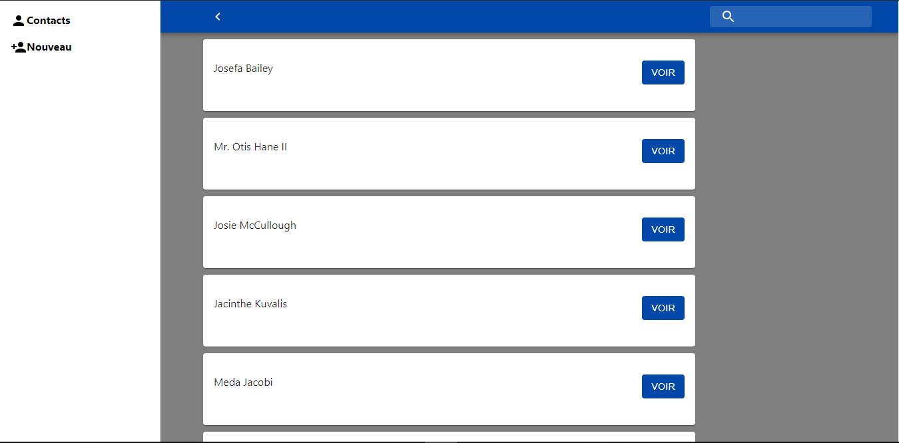

# Table des matières
1. [info general](#description)
2. [Technologies](#technologies)
3. [Installation](#installation)

## Description
***
petite application des gestions des contacts en React

## Technologies
***
les technologies utilisés sont repris sur la liste ci-dessous:
* [react] (https://reactjs.com)
* [react-redux] (https://react-redux.js.org)
* [react-router]
* [users-api] (http://seleshabani.mpwasa-magazine.com) (https://github.com/seleshabani/test_kda_backend) l'api fournissant la liste des contacts

## Installation
***
* se placer dans un répertoire de son pc en local
* ensuite à partir du terminal faire : git clone https://github.com/seleshabani/test_kda_frotend.git
* se placer dans le dossier créer puis faire toujours dans le terminal : npm install
* une fois l'installation terminé faire : npm start

## View

